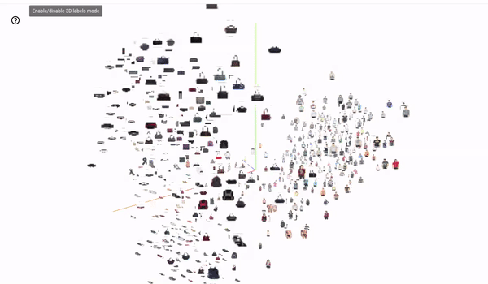

# Jina AI with GSoC 2022

<b>
X
</b>

## 🔎 Who are we?

<b>
Welcome to the GSoC projects page of Jina AI! 
</b>

[Jina AI](https175 hours://jina.ai/) helps developers around the world build neural-search<a href="https://docs.jina.ai/get-started/neural-search/">?</a> powered apps in minutes. We focus on making AI usable for advanced human interactions and building a better ecosystem for developers. 

We are firm supporters of open source and have open sourced multiple projects, including:
 
- [**Jina**](https://github.com/jina-ai/jina): A cloud-native neural search framework to build state-of-the-art and scalable deep learning search applications in minutes.
- [**DocArray**](https://github.com/jina-ai/docarray): A library for nested, unstructured data in transit, including text, image, audio, video, 3D mesh, etc. It allows deep-learning engineers to efficiently process, embed, search, recommend, store, and transfer the data with a Pythonic API.
- [**Finetuner**](https://github.com/jina-ai/finetuner): Lets developers tune the weights of any deep neural network for better embeddings on search tasks.

We have also built an open source "app store" for sharing neural search components at [Jina Hub](https://hub.jina.ai/). These projects work in synergy to help developers build solutions for various problems, from image search to 3D model search, from semantic search to text-to-image search, from question-answering systems to outlier detection. 

We are always enthusiastic about GSoC and we believe this experience will help us empower more users, improve open source and overall, enhance developer experience. 

Listed below are project ideas which work towards the idea of using AI for good. Each project comes with a lot of learning and every participant will be guided thoroughly by our dedicated mentors. Please feel free to come up with your own ideas too!

We invite everyone to participate in GSoC 2022 with Jina AI!

## 🤙 Communication

We have our own [Slack community](https://slack.jina.ai) for communication. Please feel free to contact the mentors listed below on the #gsoc-support channel with your queries. 

## 📝 How to apply

To apply for one of our projects, candidates need to create a proposal. If:

- 👉 Option 1: You want to work on your own project idea. The first step would be to get the project idea approved by the mentors by discussing with them over slack. Next, a proposal should be made for that project.

- 👉 Option 2: You want to work on a project idea listed below. Discuss with mentors about the architechture and how you plan on doing it. Next, create a proposal and submit it.

Any proposal submitted should follow [this](https://docs.google.com/document/d/1vPWIxH-o8KBIbL1FPZai5EBLWWnDy2K6FXc2HV3D1q8/edit?usp=sharing) proposal template. Submissions need to be made via email. Please send your proposals to google-soc@jina.ai
 before the deadline as mentioned in the [program timeline](https://developers.google.com/open-source/gsoc/timeline).

For questions about how to create a good proposal, please refer to the [proposal guide](https://google.github.io/gsocguides/student/writing-a-proposal) from GSoC. 

## 🎓 What you will get

We strive to be helpful and welcoming to new open-source contributors. We hope that we can give participants a strong foundation of contributing to open-source artificial intelligence and neural search technologies and learn engineering best practices through their GSoC tenure with us.

All the mentors are from our own engineering team. They will mentor and review the mentee’s deliverables in detail, with timely communication and tracking of projects' progress, ensuring a very enriching internship experience.

You can expect to:

- Learn how to work in an open-source project.
- Learn how to build a neural search system with state-of-the-art neural networks.
- Learn best practices in writing code.
- Get credits from GSoC.
- Get awesome swag.
- Upon successful project completion, get invited as a speaker for our community events.
- Dive deeply into AI and ML, learn new concepts and develop apps that serve a purpose.

## 💡 Project ideas

| Title                           | Involves      | Skills needed              | Mentors |
|---------------------------------|---------------|----------------------------|------------|
| [Accurate landmark search system](#project-idea-1-accurate-landmark-search-system) | Jina, DocArray, Finetuner | Python, Deep learning | Bo(dot)Wang(at)jina(dot)ai, Jie(dot)Fu(at)jina(dot)ai|
| [Jina AI playground](#project-idea-2-jina-ai-playground)              | Jina, DocArray | JavaScript, Python, HTML, CSS |Yanlong(dot)Wang(at)jina(dot)ai |
| [Data visualisation in the browser using DocArray](#project-idea-3-data-visualisation-in-the-browser-using-docarray) | DocArray | JavaScript, Python, HTML, CSS|Bo(dot)Wang(at)jina(dot)ai|
| [3D search application](#project-idea-4-3d-search-application---build-and-finetune) | Jina, DocArray, Finetuner | Python, Deep learning | Felix(dot)Wang(at)jina(dot)ai |

### *Project idea 1: Accurate landmark search system*

| info | details |
|---------------|---------------|
| Involves | Jina, DocArray, Finetuner |
| Skills needed | Python, Deep Learning |
| Project size | 175 hours |
| Mentors | Bo(dot)Wang(at)jina(dot)ai , Jie(dot)Fu(at)jina(dot)ai |

Landmark retrieval is a hot topic in both academic research and industrial applications. We realise the importance of landmark retrieval rising up again post-COVID. As tourist places open again, we can expect an increase in the number of queries tackled related to landmark search. 

The project aims to create an image-to-image search system, wherein we input an image containing a tourist landmark and expect to retrieve photos of the same landmark sites but taken at different times of the year. However, most of the work thus far has been to optimise accuracy, rather than "usefulness", of the search results. 

This application expects you to train a machine learning model and create a faceted search system. The model will be trained to recognize not only similar images, but also rank them on the basis of months in a year. The faceted search will enable users to filter search results and manipulate searches according to their use cases.

For instance, given a photo of the Great Wall of China, the system renders Great Wall photos and re-ranks them by different seasonal images (e.g. summer scene, winter scene etc..). 

Finally, the trained model will be put to use in building a tourist landmark search system with Jina. An additional task would be to showcase the tag of "safe to visit" or "unsafe to visit" in the pandemic.
 

### *Project idea 2: Jina AI Playground*

| info | details |
|---------------|---------------|
| Involves | Jina, DocArray |
| Skills needed | JavaScript, Python, HTML, CSS |
| Project size | 175 hours |
| Mentors | Yanlong(dot)Wang(at)jina(dot)ai |

We have maintained a few examples ranging from image search to question-answering systems to demonstrate the power of neural search. Meanwhile, we see that some of our community members get frustrated by setting the right environment when they want to try out these examples. 

To solve this problem, we propose to create an integrated playground IDE for Jina where code can be seen in action.

This project will combine [Jina’s backend](https://github.com/jina-ai/jina/) with external frontend frameworks to create a playground where developers will be able to see the source code and the output it renders. 

### *Project idea 3: Data visualisation in the browser using DocArray*

| info | details |
|---------------|---------------|
| Involves | DocArray |
| Skills needed | JavaScript, Python, HTML, CSS |
| Project size | 175 hours |
| Mentors | Bo(dot)Wang(at)jina(dot)ai |

Data visualisation helps lay a better foundation for data interpretation. Data engineers require data visualisation the most and efforts have been made in making data visualisation easier and faster. 

We have built-in feature of [DocArray](https://docarray.jina.ai) that allows users to [visualise their data](https://docarray.jina.ai/fundamentals/documentarray/visualization/). Adding to this, users can also manipulate their data in any way they want. The main motivation behind this project is to showcase DocArray’s visualisation capabilities quickly and give users a hands-on experience.

We want to make use of front-end frameworks to bring DocArray’s capabilities to the browser. The idea is to implement DocArray’s visualisation feature in the browser so that with just a few clicks, users are able to see and interpret their data. The backend would be based on DocArray and written solely in Python while for the front-end any framework can be used.

Additional functionalities are welcome but are not a necessity. These additional functionalities will cater to implementing different DocArray functions in the browser like [creating a DocArray](https://docarray.jina.ai/fundamentals/documentarray/construct/), [matching nearest neighbours](https://docarray.jina.ai/fundamentals/documentarray/matching/), [embedding](https://docarray.jina.ai/fundamentals/documentarray/embedding/), etc.

### *Project idea 4: 3D search application - Build and Finetune*

| info | details |
|---------------|---------------|
| Involves | Jina, DocArray, Finetuner |
| Skills needed | Python, Deep Learning |
| Project size | 175 hours |
| Mentors | Felix(dot)Wang(at)jina(dot)ai |
	

A 3D mesh is the structural build of a 3D model consisting of polygons. The data type is used in a variety of places but it is not always easy to create a search system catering to only 3D mesh data types. For this project, we have narrowed down our use case to 3D printing. 

The goal of this project is to build a neural search app where users will be able to find similar 3D models based on a given input. The project involves three steps:

1. The user uploads the 3D file as a query. The matching here becomes a simple search
1. The user uploads images as a query. The challenge would be to take 2D input and render 3D models as output.
1. (optional) The user inputs text as a query. The challenge here will be to take the input as text and render 3D models related to it.

If you want to know more about how to handle 3D meshes, look into the Jina documentation on [3D mesh](https://docarray.jina.ai/datatypes/mesh/).

### *Your own idea!*

If you have any ideas of your own, please feel free to send them to the mentors listed below. Your message should clearly state the project idea, the motivation behind it, the benefits it brings and a brief idea of how you wish to implement it. The project idea needs to be approved by the mentors to be officially accepted.

## 🏁 Get started

- Please introduce yourself in #gsoc-introductions channel in our [Slack community](https://slack.jina.ai).
- Learn about Jina by reading the [documentation](https://docs.jina.ai/) and [Learning Portal](https://learn.jina.ai).
- Check out [Jina Hub](https://hub.jina.ai).

